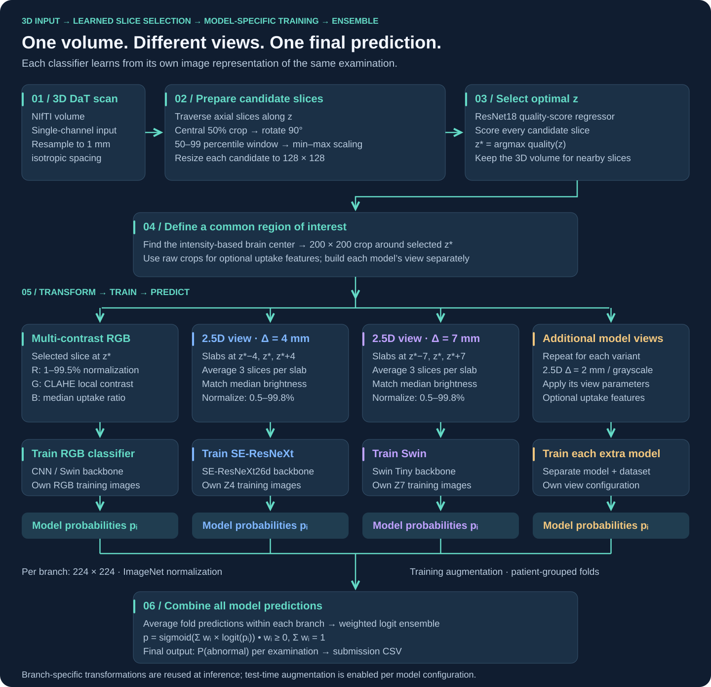

# DaT Parkinson's — learned slice selection & multi-view ensembles

**From 3D DaT scans to a probability of abnormality, through a learned axial-slice selector and complementary 2D / 2.5D views.**

[](https://github.com/IvanTriandofilidi/dat-parkinsons-ml/actions/workflows/ci.yml)




An engineering refactor of my solution for the [DrivenData DaT Parkinson's Challenge](https://www.drivendata.org/competitions/311/dat-parkinsons-challenge/). The competition task is to classify DaT examinations as **normal or abnormal**, not to diagnose Parkinson's disease directly. The primary metric is **log loss**; AUROC is a secondary reference metric.

The original work was developed across [Kaggle](https://www.kaggle.com/code/ivantriandofilidi/dat-parkinson) and [Colab](https://colab.research.google.com/drive/1qCBlGvt3ugkqL6cME0UFm_c7xQ_9ExmG). This repository turns those experiments into an importable package with explicit input contracts, reproducible entry points, and documented evaluation limits.

## The approach

1. **Learn where to look.** A one-channel ResNet18 regresses manually assigned slice-quality scores. Score the central crop of each axial array slice after 1 mm resampling; select the highest-scoring z. Selector validation groups slices by patient.
2. **Preserve complementary information.** A 200 × 200 crop around the intensity-based brain center becomes either a synthetic RGB view (percentile intensity / CLAHE / uptake ratio) or a 2.5D view with three averaged slabs at z−Δ, z, z+Δ. The notebook experiments used Δ = 2, 4, and 7 mm.
3. **Train diverse classifiers.** CNN and Swin branches use image features and, optionally, two geometric uptake proxies. Each fold learns its own missing-feature imputation values.
4. **Combine probabilities in logit space.** Nonnegative weights sum to one. The selected blend is applied to new examinations without fitting statistics on the test batch.

The source notebooks explored several variants. The package provides a shared implementation for RGB, grayscale, and configurable 2.5D views; example training configurations capture the observed SE-ResNeXt Z4 and Swin Z7 experiments. The RGB baseline is a new comparison configuration. These are **refactored experiment configurations**, not a claim that all original checkpoints have been reproduced.

## Results and their scope

The following values were transcribed from the saved Colab outputs on a 1,362-patient aligned OOF cohort. They have **not** been recomputed by this refactor.

| Original experiment | Log loss ↓ | AUROC ↑ |
|---|---:|---:|
| 2.5D Z4 | 0.2644 | 0.9563 |
| DenseNet121 | 0.3177 | 0.9369 |
| Swin RGB | 0.3293 | 0.9342 |
| Swin Z2 + SBR + TTA | 0.2460 | 0.9602 |
| Swin Z7 | 0.2547 | 0.9574 |
| Five-branch logit blend, **weight-fitting score** | **0.2189** | **0.9693** |

The blend weights were optimized on the same OOF rows used to calculate its score. **0.2189 is a fitting result, not an independent test score or a leaderboard score.** The notebook also removed 20 duplicate rows from one prediction table; their upstream origin and effect on fold integrity remain unresolved. See [evaluation and limitations](docs/evaluation.md) before interpreting these numbers.

No competition rank, private leaderboard score, clinical effectiveness, or exact reproduction is claimed.

## Run without competition data

Use Python 3.11 or newer. A CPU-only installation is enough for tests and the synthetic integration demo:

```bash
python -m venv .venv
# Linux / macOS: source .venv/bin/activate
# Windows PowerShell: .venv\Scripts\Activate.ps1
python -m pip install torch torchvision --index-url https://download.pytorch.org/whl/cpu
python -m pip install -e ".[dev]"
pytest -q
dat-parkinsons demo --output runs/demo
```

The demo writes a synthetic NIfTI volume, initializes random model weights, loads a complete inference bundle, and writes a valid `uid,is_pathologic` submission twice to check determinism. **Its prediction has no diagnostic meaning.** It downloads no pretrained weights and uses no patient data. Choose a new output directory for each run.

For GPU training, install a compatible CUDA build of PyTorch using the [official installer](https://pytorch.org/get-started/locally/) before installing the package.

## Train and predict

Training requires locally held data and annotations that you are authorized to use. The repository distributes neither. See [the data contract](docs/data.md) and [the full reproduction guide](docs/reproduction.md).

```bash
# 1. Evaluate the slice scorer using patient-grouped CV.
dat-parkinsons train-selector --labels data/slice_labels/z_slice_labels.csv --output runs/selector_cv --device cuda

# 2. Refit for a fixed number of epochs chosen from training-side experiments.
dat-parkinsons train-selector --labels data/slice_labels/z_slice_labels.csv --output artifacts/selector --epochs 50 --final --device cuda

# 3. Prepare a chosen classifier view with the same selector used at inference.
dat-parkinsons prepare --nifti-dir data/niftis --labels data/train_labels.csv --scorer artifacts/selector/selector.pt --config configs/swin_z7.json --output data/prepared_z7 --device cuda

# 4. Create shared patient folds and train a classifier branch.
dat-parkinsons folds --manifest data/prepared_z7/manifest.csv --output artifacts/folds.csv
dat-parkinsons train-classifier --manifest data/prepared_z7/manifest.csv --folds artifacts/folds.csv --config configs/swin_z7.json --output runs/swin_z7 --device cuda

# 5. Fit a blend after generating all listed branch OOF files.
dat-parkinsons fit-blend --tables configs/prediction_tables.example.json --output artifacts/blend.json

# 6. Assemble a bundle with the fitted model_order / weights and matching checkpoints.
dat-parkinsons predict --bundle configs/bundle.example.json --nifti-dir data/test_niftis --output runs/submission.csv --device cuda
```

The two-branch bundle is a schema example with **equal placeholder weights**. Train both branches, inspect their validation behavior, and replace its weights with your saved blend artifact before using it as a fitted ensemble. The reproduction guide includes the second branch commands and explains checkpoint provenance.

## Engineering decisions

| Concern | Implementation |
|---|---|
| Notebook execution order | Separate modules; no training or file discovery on import |
| Duplicate examinations | Reject duplicate IDs before folds, joins, or prediction |
| Silent patient loss in ensemble merges | Require identical ID sets, labels, and available fold assignments |
| Training / serving differences | One view builder; identical PNG quantization and normalization |
| Missing uptake features | Persist training-fold medians; never infer them from a test batch |
| Model artifact ambiguity | Store architecture, preprocessing, TTA policy, seed, and scorer hash |
| Unexpected pretrained downloads | Inference always constructs models with `pretrained=False` |
| Evaluation overstatement | Separate blend fitting from disjoint-patient evaluation |
| Portability | Relative paths, CPU support, Python package, CLI, synthetic CI |

## Repository map

```text
src/dat_parkinsons/   preprocessing, models, training, ensemble, inference, CLI
configs/             explicit experiment and inference-bundle examples
notebooks/           ordered, output-free walkthrough
tests/               numerical, identity, fold, and evaluation-contract tests
docs/                reproduction, evaluation audit, data contract, model card
reports/             historical aggregate results and verification record
.github/workflows/   CPU tests, synthetic inference, and package build
```

Start with [the walkthrough](notebooks/01_pipeline_walkthrough.ipynb), [source-to-package mapping](docs/source-map.md), or [the model card](docs/model-card.md).

## Data and intended use

Research and portfolio use only. No clinical validation or deployment approval is claimed. The challenge's published rules restrict data use and redistribution; the original competition permission does not establish permission for post-competition reuse. Obtain an applicable license before training or redistributing derived artifacts. Tests and illustrations in this repository use synthetic data only. See the [official competition rules](https://www.drivendata.org/competitions/311/dat-parkinsons-challenge/) and [data contract](docs/data.md).

Code is released under the [MIT License](LICENSE). Third-party pretrained weights and datasets retain their own licenses.
