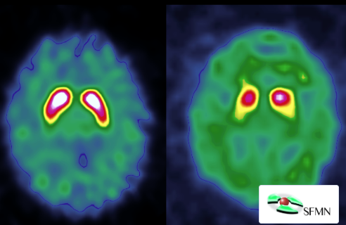
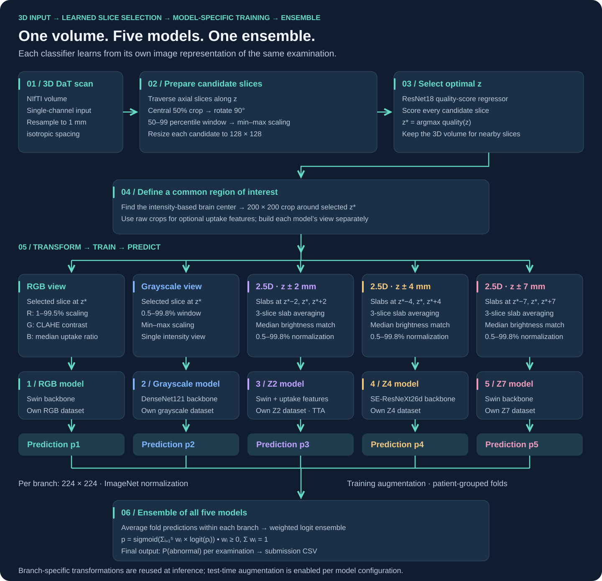
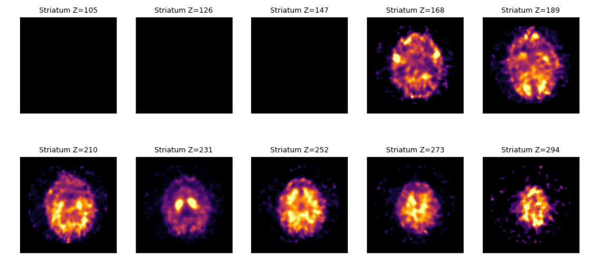

# DaT Parkinson's — learned slice selection & multi-view ensembles

**A two-stage approach to DaT scan classification: learn where to look, then combine complementary views.**

[](https://github.com/IvanTriandofilidi/dat-parkinsons-ml/actions/workflows/ci.yml)


I built this project for the [DrivenData DaT Parkinson's Challenge](https://www.drivendata.org/competitions/311/dat-parkinsons-challenge/). My goal was to turn a 3D dopamine transporter scan into a probability that the examination is abnormal, using a learned slice selector and an ensemble of image classifiers.

<p align="center">
  
</p>

*Different DaT uptake patterns illustrate the image-classification task. This is a reference illustration, not a prediction produced by the model. The SFMN credit is retained in the image.*

## Why I used a two-stage pipeline

A full 3D scan contains many slices, while the striatal region is especially relevant to this task. I separated the problem into two parts: finding an informative axial slice and classifying the selected region. This lets me use pretrained 2D backbones while retaining nearby spatial information through 2.5D inputs.

The pipeline predicts **normal versus abnormal DaT examinations**. Its output is a scan-level probability, not a standalone diagnosis of Parkinson's disease.



## 1. Learn the most informative slice

I trained a one-channel ResNet18 to predict manually assigned slice-quality scores. Each volume is resampled to 1 mm spacing, and each candidate slice is cropped, percentile-normalized, and resized to 128 × 128. The slice with the highest score becomes the reference position, **z**.

Slices from the same patient stay together during selector cross-validation.



*A 3D volume viewed as a sequence of 2D axial slices. The uptake pattern changes with z; the selector searches for an informative view of the striatal region within the basal ganglia. The montage illustrates the selection problem and does not mark a model-selected winner.*

## 2. Build complementary image representations

Around the selected z, I create a 200 × 200 crop centered on the intensity-based brain center and build three types of representation for five separate models:

| Representation | Input channels | Purpose |
|---|---|---|
| Multi-contrast RGB | Percentile-normalized intensity, CLAHE, uptake ratio | Combine overall uptake with local contrast |
| Grayscale | Percentile-normalized intensity of the selected slice | Preserve the original intensity pattern |
| 2.5D stack | Averaged slabs at z−Δ, z, z+Δ | Retain nearby spatial information in a 2D backbone |

I explored offsets of **2, 4, and 7 mm**. Some branches also use two geometric uptake features: mean uptake relative to a background region and an asymmetry measure. Missing feature values are imputed using training-fold statistics saved with the model.

## 3. Train classifiers and combine their predictions

I trained five separate classifiers: **RGB, grayscale, z±2, z±4, and z±7**. Each model receives its own transformed dataset. I then combine all five models’ probabilities in logit space. The ensemble uses nonnegative weights that sum to one:

```text
p(ensemble) = sigmoid(Σ weight[i] × logit(p[i]))
```

The package supports configurable image views, optional uptake features, shared patient folds, and fold-model averaging at inference. The example configurations cover SE-ResNeXt Z4, Swin Z7, and an RGB baseline.

## Experimental results

The comparison below uses recorded OOF predictions for **1,362 examinations**. Ensemble weights were optimized on these same predictions. The values come from the original experiments; full training has not been rerun with the packaged implementation.

| Model / representation | Log loss ↓ | AUROC ↑ |
|---|---:|---:|
| 2.5D Z4 | 0.2644 | 0.9563 |
| DenseNet121 | 0.3177 | 0.9369 |
| Swin RGB | 0.3293 | 0.9342 |
| Swin Z2 + SBR + TTA | 0.2460 | 0.9602 |
| Swin Z7 | 0.2547 | 0.9574 |
| **Five-model logit ensemble** | **0.2189** | **0.9693** |

Log loss is the primary competition metric. I track AUROC alongside it to compare ranking performance. Details of the evaluation protocol are in [the evaluation notes](docs/evaluation.md).

## Engineering implementation

I organized the project around a shared preprocessing and inference path, explicit experiment configurations, and self-describing checkpoints.

- **Shared preprocessing:** the same image construction, quantization, and normalization for training preparation and inference.
- **Patient-level validation:** shared fold manifests and strict alignment of prediction tables by patient ID.
- **Complete checkpoint metadata:** architecture, image view, training-fold imputation values, TTA policy, seed, and selector hash.
- **Independent examination processing:** inference uses each scan and saved training artifacts without estimating statistics from the test batch.
- **Portable execution:** Python package, CLI commands, CPU support, and relative paths.
- **Automated checks:** numerical and data-contract tests, short synthetic training runs, and an end-to-end inference demo in GitHub Actions.

## Quick start

Use Python 3.11 or newer. The CPU installation is sufficient for the tests and synthetic demo:

```bash
python -m venv .venv
# Linux / macOS: source .venv/bin/activate
# Windows PowerShell: .venv\Scripts\Activate.ps1
python -m pip install torch torchvision --index-url https://download.pytorch.org/whl/cpu
python -m pip install -e ".[dev]"
pytest -q
dat-parkinsons demo --output runs/demo
```

The demo generates a synthetic NIfTI volume, loads randomly initialized models, and writes a submission twice to check repeatability. It tests the software path; its prediction has no diagnostic meaning. Use a new output directory for each run.

For GPU training, install a compatible CUDA build using the [PyTorch installer](https://pytorch.org/get-started/locally/).

## Training and inference

The pipeline is split into explicit stages:

```text
train-selector → prepare → folds → train-classifier → fit-blend → predict
```

For example, to prepare and train the Swin Z7 branch with a trained selector:

```bash
dat-parkinsons prepare --nifti-dir data/niftis --labels data/train_labels.csv --scorer artifacts/selector/selector.pt --config configs/swin_z7.json --output data/prepared_z7 --device cuda

dat-parkinsons folds --manifest data/prepared_z7/manifest.csv --output artifacts/folds.csv

dat-parkinsons train-classifier --manifest data/prepared_z7/manifest.csv --folds artifacts/folds.csv --config configs/swin_z7.json --output runs/swin_z7 --device cuda
```

After training the required branches and assembling an inference bundle:

```bash
dat-parkinsons predict --bundle configs/bundle.example.json --nifti-dir data/test_niftis --output runs/submission.csv --device cuda
```

The output has two columns: `uid,is_pathologic`. The example bundle contains equal placeholder weights; replace them with the saved blend weights and matching model checkpoints. Follow the [reproduction guide](docs/reproduction.md) for selector training, the second branch, and ensemble setup.

## Project structure

```text
src/dat_parkinsons/   preprocessing, models, training, ensemble, inference, CLI
configs/             experiment configurations and inference-bundle examples
notebooks/           ordered pipeline walkthrough
tests/               numerical, data-contract, and training tests
docs/                method, reproduction guide, evaluation notes, model card
reports/             recorded results and software verification
.github/workflows/   automated CPU checks and package build
```

Explore the [walkthrough](notebooks/01_pipeline_walkthrough.ipynb), [data contract](docs/data.md), [model card](docs/model-card.md), or [verification report](reports/verification.md).

## Data and use

This is a research project. Training requires appropriately licensed data and slice-quality annotations; the training dataset and trained competition weights are not distributed here. The README includes two supplied reference illustrations; automated tests use synthetic data. Clinical use would require separate validation.

Code is available under the [MIT License](LICENSE). Third-party images, pretrained weights, and datasets retain their respective rights and licenses.
